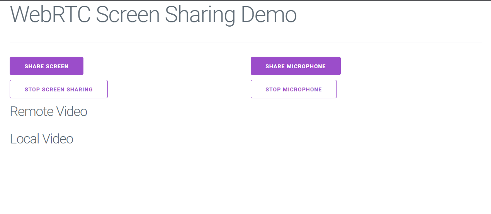

# WebRTC Screen Sharing Demo

## Powered by [Metered Screen Sharing API](https://www.metered.ca)

## Overview

This application contains the code group screen sharing application, where multiple users can join the meeting and share their screen with each other.

## Guide

The step by step guide on how this application was built can be found here: [WebRTC Screen Sharing with Javascript](https://www.metered.ca/blog/webrtc-screen-sharing/).

## Project Structure
All the code for the project is present in the `index.html` file.

The `index.html` file has a script tag at the bottom that contains the javascript code for the application.

Metered [Screen Sharing API](https://www.metered.ca) makes it very easy to build real time video applications.

## Setup Requirements

Before you use this application, you would have to create Room, and obtain the Room URL. To get a room URL:

- Signup for a free account from [metered.ca](https://www.metered.ca)-> **Signup and Start Building**
- Then go to **dashboard**->**Create Room** and create the room
- Your Room URL is `"<name-of-your-app>.metered.live/<name-of-your-room>"`

## Further Reading

- [Metered Blog](https://www.metered.ca/blog)
- [Metered SDK Docs](https://www.metered.ca/docs)

### Other Projects
- [Live Streaming Application](https://github.com/metered-ca/webrtc-live-streaming-demo)
